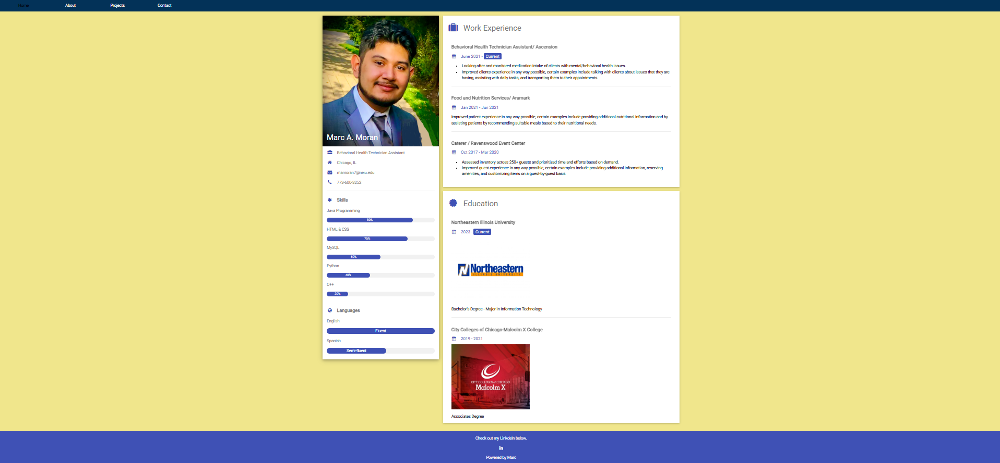
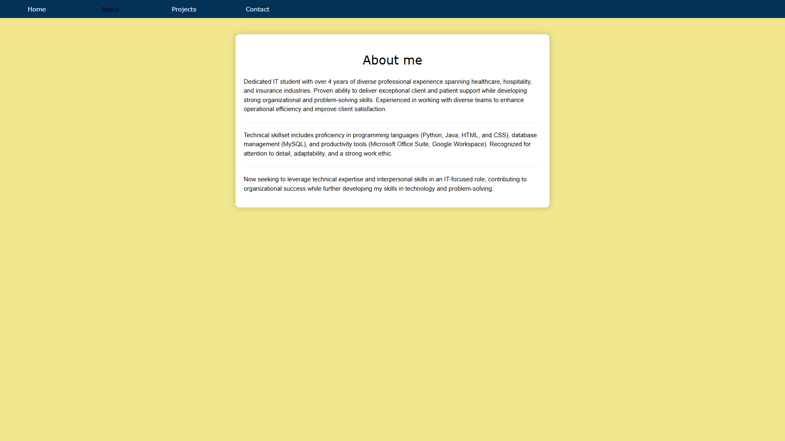
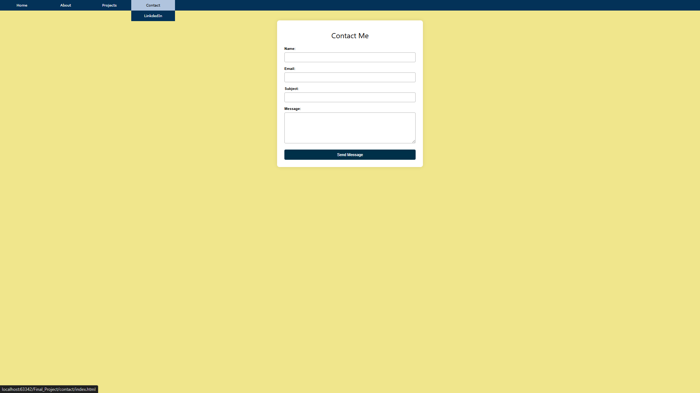
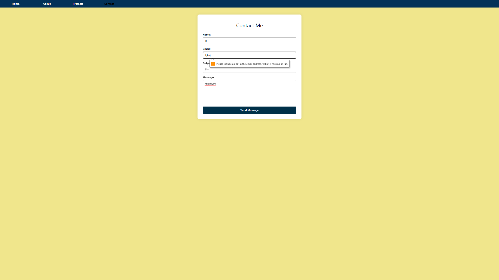
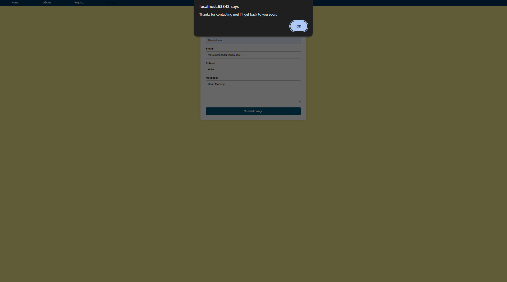
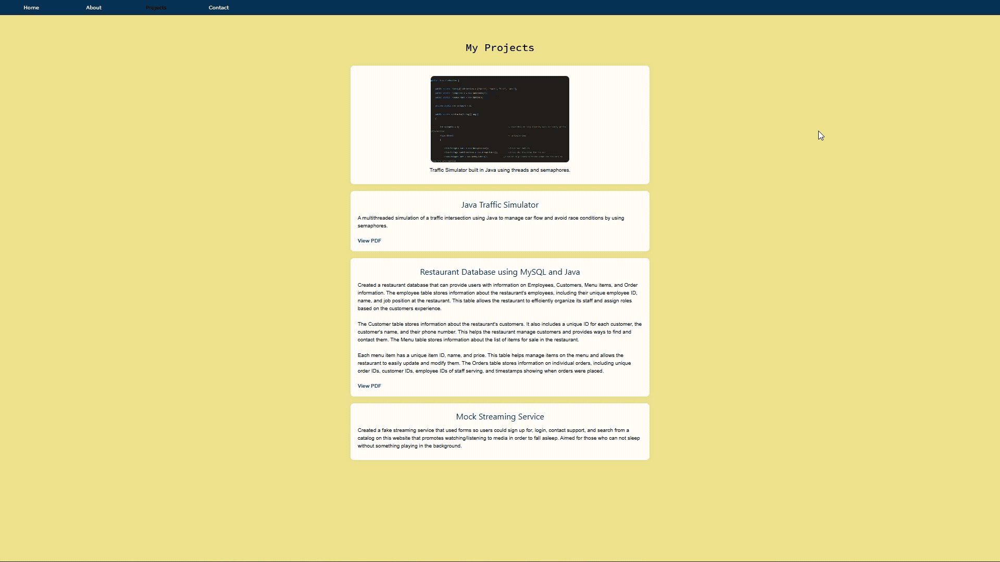

# Personal Portfolio Website

A multi-page personal portfolio website built using HTML, CSS, and JavaScript. This project showcases my skills, projects, and background in IT and software development through a clean, structured, and user-friendly interface.

## Overview

This portfolio website was created to serve as a central hub for displaying my work and experience. It highlights my projects, provides information about me, and offers a way for others to get in contact. The project focuses on building a solid front-end foundation with organized file structure and responsive design principles.

## Features

* Multi-page website (Home, About, Projects, Contact)
* Clean and organized layout
* Project showcase section
* Custom styling with CSS
* Interactive elements using JavaScript
* Simple and intuitive navigation
* Responsive design structure

## Tech Stack

* HTML5
* CSS3
* JavaScript
* Git
* GitHub

## Skills Demonstrated

* Front-end web development
* Website structure and organization
* Responsive design fundamentals
* DOM manipulation with JavaScript
* Project-based workflow using Git
* Building a professional online portfolio

## How to Run

1. Clone this repository
2. Open the project folder
3. Open `index.html` in your browser

## Future Improvements

* Improve mobile responsiveness
* Add more detailed project pages
* Enhance UI/UX design
* Add animations and transitions
* Integrate a backend for contact form functionality

## Author

Marc Moran
